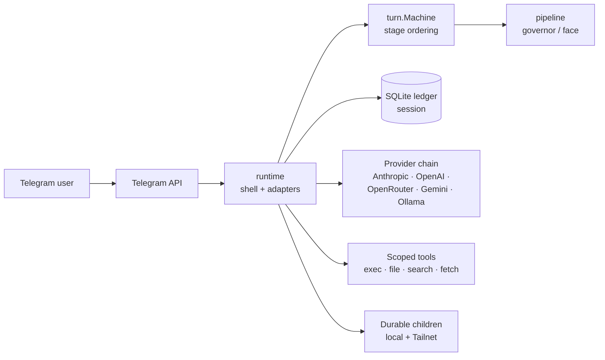

# Aphelion

Aphelion lets you operate a personal AI agent from Telegram with explicit
consent and auditable execution. It runs as a Linux service on a machine you
control.

## Why Aphelion

Most AI harnesses are built for a developer at a terminal. Aphelion is built
for an operator with a phone.

- **You approve before the agent acts.** Every tool call waits for your
  explicit OK, or for a time-bounded approval window you opened.
- **The audit is structural.** Authority, consent, leases, grants, and
  execution are rows in a SQLite ledger; the chat transcript is the
  presentation layer.
- **You operate from Telegram.** Approve, inspect, stop, recover, and review
  evidence from your phone. The CLI handles install and local repair.
- **You own the machine.** Linux only, single binary, single host. No cloud
  account, no SaaS dashboard.
- **You pick the model.** Anthropic, OpenAI, OpenRouter, Gemini, or Ollama,
  configurable per work lane, with failover.

## What's in the box

- **Operator surfaces (Telegram):** approvals, `/health`, `/status`,
  `/context`, `/memory`, `/mission`, `/model`, side threads via `/thread`.
- **Voice:** Telegram voice-note transcription on input; optional ElevenLabs
  replies on output.
- **Tools:** scoped exec, file, search, and fetch tools; curated memory and
  session recall; optional OpenAI hosted-storage integration.
- **Automation:** heartbeat, cron, and bounded auto-approval leases with
  separate state for the main chat and each side thread.
- **Durable children:** configured agents that survive restarts, with daily
  review recipes, Telegram group admission, and Tailnet provisioning of
  remote-host children.
- **Service plumbing:** Linux user-service install/update scripts, optional
  GitHub App token helper, health and inventory surfaces.

The design direction lives in
[docs/architecture/design-principles.md](docs/architecture/design-principles.md).

## Install

Pin the installer and release asset to a public release tag:

```bash
APHELION_VERSION=v0.1.3
curl -fsSL "https://raw.githubusercontent.com/idolum-ai/aphelion/${APHELION_VERSION}/scripts/install-release.sh" | bash -s -- "${APHELION_VERSION}"
~/.local/bin/aphelion quickstart --detect-admin --install-service
```

Headless:

```bash
APHELION_TELEGRAM_BOT_TOKEN=123:abc \
OPENAI_API_KEY=sk-... \
~/.local/bin/aphelion quickstart --admin-user-id 123456789 --provider openai --install-service
```

Other supported providers: `anthropic`, `openrouter`, `gemini`, `ollama`. See
[Operator Setup](docs/guides/operator-setup.md) for configuration details.

`quickstart` writes `~/.aphelion/aphelion.toml` with mode `0600`, validates it,
and refuses to replace an existing config unless `--force` is passed. With
`--install-service`, it also runs the service install and verifies the deploy.

Normal turns wait for explicit approval. After approving manually, admins can
open a bounded 15-minute approval window from the approved Telegram message;
the inline controls create the temporary automation gate and matching grant
together.

## Start Here

- New operator: [Quick Experiment](docs/guides/quick-experiment.md)
- Skilled operator: [Operator Setup](docs/guides/operator-setup.md)
- Child agents: [Durable Children](docs/guides/durable-children.md)
- Telegram workflows: [Telegram Operations](docs/guides/telegram-operations.md)
- Contributors: [Contributor Handbook](docs/guides/contributor-handbook.md)
- Full docs map: [docs/README.md](docs/README.md)
- Current promises: [docs/promises.md](docs/promises.md)

## Operate

Telegram handles live work; the CLI and systemd handle install and local
repair. Useful CLI checks:

```bash
~/.local/bin/aphelion sandbox-net check --config ~/.aphelion/aphelion.toml
~/.local/bin/aphelion github-app status --config ~/.aphelion/aphelion.toml
~/.local/bin/aphelion verify-deploy --config ~/.aphelion/aphelion.toml
systemctl --user status aphelion
journalctl --user -u aphelion -f
```

From Telegram, start with `/health`, `/status`, and `/help`. Use `/thread` to
fork a side lane. Use `/context` and `/memory` to inspect what is shaping
replies. Use `/mission` for objective review and `/model` for admin
model-routing controls. Full command reference:
[docs/telegram-ui-features.md](docs/telegram-ui-features.md).

Isolated work defaults to no network. When a non-admin or durable profile
needs narrow internet access, use the helper-backed path in
[docs/guides/sandbox-networking.md](docs/guides/sandbox-networking.md).

For source checkout work on Linux (requires Go 1.26+; check with `go version`):

```bash
make build
make test
make architecture
```

On macOS or other non-Linux hosts:

```bash
make verify-linux-compile
```

## Architecture



Three packages carry the core flow:

- **`runtime`** — long-lived shell, transport wiring, locks/scopes, background
  loops, durable-agent lifecycle, port assembly.
- **`turn`** — one-turn state machine, stage ordering, run-kind policy,
  commit/delivery contracts.
- **`pipeline`** — governor/face conversational transforms; render/floor
  contract helpers.

All other packages (`agent`, `config`, `core`, `face`, `prompt`, `provider`,
`session`, `tool`, etc.) are implementation details consumed by `runtime`.

Full architecture set (package map, turn sequence, constitutional flow,
durable topology, state surfaces, delivery polymorphism, present vs.
intended): [docs/architecture/README.md](docs/architecture/README.md). Package
detail: [runtime/README.md](runtime/README.md),
[turn/README.md](turn/README.md), [pipeline/README.md](pipeline/README.md).
Requirements: [requirements/INDEX.md](requirements/INDEX.md).

## Verify

Before changing behavior on Linux:

```bash
go test ./...
make architecture
make design-principles
make public-readiness
make secrets   # when Gitleaks is installed
git diff --check
```

On non-Linux hosts, `make test` and `make architecture` intentionally stop
with a Linux-only message. Use `make verify-linux-compile` for a static
compile check, then run the full verification on Linux before merge.

Run `make design-principles` *(static analysis of authority/consent/control
surfaces)* when touching authority, consent, continuation, wake, goal,
status, or operator-facing control surfaces.

Run `make live-evals` or the narrower `make auto-evals` *(opt-in; spend
provider API calls)* before releases that materially change agency,
authority, proactive mission, or prompt behavior.

## Support

If this project saves you time or becomes part of your stack, you can support
its maintenance through [GitHub Sponsors](https://github.com/sponsors/idolum-ai).

## License

[Apache-2.0](LICENSE)
