# Durable Children

Durable children are bounded channel-specific organs, not alternate public
personas.

## Live Shape

- Parent runtime owns durable-agent registry and wake loops.
- Child execution stays scoped by charter and channel policy.
- Upward communication is through bounded review artifacts and summaries.
- Email children support poll, push, or poll-or-push wake modes.
- Email synthesis respects cadence buffering (`synthesis_cadence`) and enforces channel `never_retain` scrubbing before review emission.

Code anchors:

- [`durableagent/runtime.go`](../../durableagent/runtime.go)
- [`runtime/durable_group.go`](../../runtime/durable_group.go)
- [`runtime/durable_email.go`](../../runtime/durable_email.go)
- [`runtime/durable_child.go`](../../runtime/durable_child.go)

## Boundaries

- Child credentials and local storage roots are child-scoped.
- Child work does not directly mutate parent prompt/memory surfaces.
- Durable child runtime reuses `turn` orchestration where lifecycle aligns.
- Child bootstraps must not carry parent Telegram polling credentials or parent principal IDs.
- Parent-child coordination uses bounded runtime channels (local bootstrap/stdout and remote control-plane HTTP), not child Telegram polling.

Related requirements:

- [`requirements/durable-agents.md`](../../requirements/durable-agents.md)
- [`requirements/security.md`](../../requirements/security.md)
- [`requirements/operations.md`](../../requirements/operations.md)
