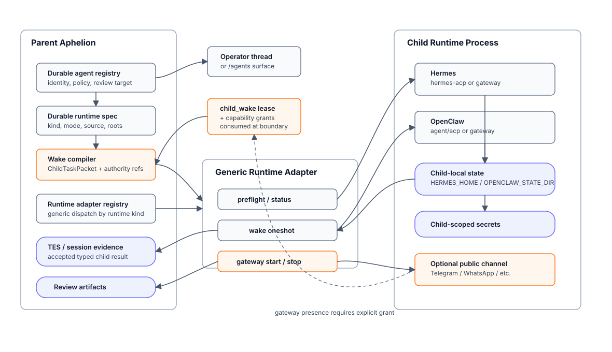

# Durable External Runtimes

_Status: architecture proposal; not implemented runtime behavior._

This document describes how Aphelion can promote an existing thread into a
durable child whose executor is not another in-process Aphelion turn, but a
supervised Hermes or OpenClaw runtime. The design keeps the current durable
child security model: Aphelion owns identity, policy, wake authority, evidence,
and review; the child runtime owns only its local process, state, and bounded
task execution.

The implementation order is generic first. Hermes and OpenClaw should be
adapter profiles over a common child-runtime contract, not bespoke parent-core
special cases.

## Reference Set

The analysis behind this proposal was grounded in these pinned revisions:

| System | Pinned revision | Relevant surfaces |
| --- | --- | --- |
| Aphelion | `873a264f664e95e5eeb721003007b9d2654b0cf8` | [`core.DurableAgent`](https://github.com/idolum-ai/aphelion/blob/873a264f664e95e5eeb721003007b9d2654b0cf8/core/durable_agents.go), [`core.ChildRuntimeContract`](https://github.com/idolum-ai/aphelion/blob/873a264f664e95e5eeb721003007b9d2654b0cf8/core/child_runtime.go), [`runtime/durable_wake.go`](https://github.com/idolum-ai/aphelion/blob/873a264f664e95e5eeb721003007b9d2654b0cf8/runtime/durable_wake.go), [`durableagent/`](https://github.com/idolum-ai/aphelion/tree/873a264f664e95e5eeb721003007b9d2654b0cf8/durableagent), [`telegram-child-bot`](https://github.com/idolum-ai/aphelion/blob/873a264f664e95e5eeb721003007b9d2654b0cf8/docs/architecture/telegram-child-bot-runbook.md) |
| Hermes Agent | `830165473e0920c2baf8c2a6863976edb0c52943` | [`pyproject.toml`](https://github.com/NousResearch/hermes-agent/blob/830165473e0920c2baf8c2a6863976edb0c52943/pyproject.toml), [`hermes_cli/main.py`](https://github.com/NousResearch/hermes-agent/blob/830165473e0920c2baf8c2a6863976edb0c52943/hermes_cli/main.py), [`acp_adapter/entry.py`](https://github.com/NousResearch/hermes-agent/blob/830165473e0920c2baf8c2a6863976edb0c52943/acp_adapter/entry.py), [`gateway/`](https://github.com/NousResearch/hermes-agent/tree/830165473e0920c2baf8c2a6863976edb0c52943/gateway) |
| OpenClaw | `c7295e417d5daec76c18fb452d117f7b8eadc4d6` | [`openclaw.mjs`](https://github.com/openclaw/openclaw/blob/c7295e417d5daec76c18fb452d117f7b8eadc4d6/openclaw.mjs), [`docs/openclaw-agent-runtime.md`](https://github.com/openclaw/openclaw/blob/c7295e417d5daec76c18fb452d117f7b8eadc4d6/docs/openclaw-agent-runtime.md), [`docs/cli/acp.md`](https://github.com/openclaw/openclaw/blob/c7295e417d5daec76c18fb452d117f7b8eadc4d6/docs/cli/acp.md), [`docs/tools/acp-agents-setup.md`](https://github.com/openclaw/openclaw/blob/c7295e417d5daec76c18fb452d117f7b8eadc4d6/docs/tools/acp-agents-setup.md) |

Local clone paths used for inspection:

- Hermes: `/tmp/hermes-agent`
- OpenClaw: `/tmp/openclaw-repo`

## Core Shape

Aphelion already has the durable-child ingredients needed for this direction:

- A durable child identity and policy record in `core.DurableAgent`.
- Child-local bootstrap, policy ceiling, storage roots, secret scopes, and
  network posture.
- Wake leases and continuation recovery around `durable_agent.wake_once`.
- External-channel runtime state for adapter status, cursor/session reference,
  failures, backoff, last artifact, and opaque adapter state.
- Review artifacts and parent conversation acknowledgement as the upward and
  downward collaboration paths.
- Child runtime materialization through `core.ChildRuntimeContract`, which can
  describe executable paths, read-only binds, secret binds, and parent-provided
  environment variables.

The missing layer is a first-class _runtime adapter contract_ between Aphelion's
durable child substrate and a non-Aphelion executor.

The parent should not learn Hermes or OpenClaw internals. It should know only
that a child runtime has:

- a source identity,
- an install and state root,
- lifecycle checks,
- a wake operation,
- bounded output and artifact contracts,
- and an authority ceiling enforced by Aphelion before the runtime starts.



## Authority Boundary

The central invariant is:

> Hermes and OpenClaw may produce child-local work and bounded projections.
> They may not grant themselves authority, mutate parent identity, or commit
> parent state without Aphelion accepting typed evidence through the usual
> durable-child lanes.

This keeps the existing durable-child model intact:

- Thread promotion is an Aphelion action.
- `child_wake` is still a separate, consumable authority event.
- Capability expansion still goes through capability requests, reviews, grants,
  attestation, and invocation checks.
- Child outputs remain projections until parent runtime records typed status,
  blocker class, retryability, artifact references, or review events.
- Channel tokens and gateway credentials are child-scoped runtime material, not
  proof of authority.

The Telegram child-bot runner is the closest current precedent: it gives one
durable child a narrow Telegram bot process, but token presence is not
authority. Hermes and OpenClaw should generalize that shape to richer runtimes,
not weaken it.

## Runtime Modes

### Oneshot Wake Mode

This is the recommended first implementation target.

The parent records a child wake claim, builds a bounded task packet, invokes the
runtime adapter once, collects a typed result, and only then acknowledges parent
conversation messages. The runtime may use its local memory and tools, but it
does not keep an ambient public gateway open.

Use this mode for:

- promoted work threads;
- scheduled child work;
- local draft/review children;
- first Hermes/OpenClaw adapter support;
- CI and live smoke tests.

### Gateway Presence Mode

This is a later mode for children that need their own Telegram, WhatsApp, or
other channel presence through Hermes/OpenClaw gateways.

Starting a gateway is a larger authority crossing than a oneshot wake. It gives
the child a standing external ingress and possibly outbound delivery. It should
require an explicit `gateway_presence` grant that names:

- runtime kind,
- channel or account,
- allowed inbound mode,
- outbound mode,
- token/secret scope,
- state root,
- review target,
- and stop/revoke behavior.

The gateway may receive messages directly, but Aphelion still owns whether those
messages become durable parent-observed events, review artifacts, or accepted
child outputs.

## User Flows

### Promote A Thread To A Hermes Or OpenClaw Child

1. Operator starts or continues a normal Aphelion thread.
2. The thread becomes important enough to retain, isolate, wake, or bind.
3. Operator chooses `Promote` from the thread surface.
4. Aphelion creates or updates a durable-agent record with `runtime.kind`
   proposed as `aphelion`, `hermes`, or `openclaw`.
5. The promotion wizard summarizes inherited context, proposed charter, storage
   roots, runtime source, and authority ceiling.
6. Admin approval activates the durable child record but does not automatically
   run it.
7. A later `wake_once` consumes a `child_wake` lease and invokes the configured
   runtime adapter.
8. The adapter writes a child task result and artifact references.
9. Aphelion records the result as typed durable evidence before advancing parent
   plans or acknowledging parent conversation messages.

### Install Or Repair A Runtime

1. Status/preflight finds missing runtime material, stale source revision, absent
   dependency, or invalid state/config root.
2. Runtime adapter returns a typed blocker such as `runtime_missing`,
   `preflight_failed`, `state_root_invalid`, or `credentials_missing`.
3. Aphelion records the blocker in durable runtime state and queues bounded
   operator review when needed.
4. Operator grants or performs install/repair through the existing capability
   and tool lifecycle lanes.
5. Adapter preflight passes and future wakes may run.

### Give A Child Public Channel Presence

1. A durable child requests gateway presence for a concrete surface such as a
   WhatsApp account or Telegram bot token.
2. Aphelion records a capability request with proposed runtime, channel,
   credential scope, and outbound policy.
3. Admin approves and grants the capability after credential provisioning and
   runtime preflight.
4. Adapter starts the Hermes/OpenClaw gateway as a child service with child-local
   state and secrets only.
5. Incoming channel events are handled through the child runtime and reported
   upward as bounded results, review artifacts, or typed blockers.
6. Revocation stops the gateway, marks authority inactive, and prevents future
   restarts until a fresh grant exists.

## Proposed Schemas

These schemas are documented contracts, not implemented storage fields in the
current codebase.

### DurableAgentRuntimeSpec

```json
{
  "runtime": {
    "kind": "hermes",
    "mode": "oneshot",
    "source": {
      "kind": "git",
      "repo": "https://github.com/NousResearch/hermes-agent",
      "ref": "830165473e0920c2baf8c2a6863976edb0c52943"
    },
    "install_root": "/var/lib/aphelion/children/research/hermes-agent",
    "state_root": "/var/lib/aphelion/children/research/hermes",
    "workspace_root": "/var/lib/aphelion/children/research/workspace",
    "entrypoint": {
      "kind": "acp_stdio",
      "command": ["hermes-acp"]
    },
    "env": {
      "HERMES_HOME": "/var/lib/aphelion/children/research/hermes"
    }
  }
}
```

Required fields:

- `kind`: `aphelion`, `hermes`, `openclaw`, or future adapter ID.
- `mode`: `oneshot`, `gateway_presence`, or `remote_service`.
- `source`: immutable or operator-owned runtime source reference.
- `state_root`: child-owned persistent state root.
- `workspace_root`: child-owned workspace root when the runtime can perform
  workspace work.
- `entrypoint`: adapter-resolved command or protocol mode.

### RuntimeSourceRef

```json
{
  "kind": "git",
  "repo": "https://github.com/openclaw/openclaw",
  "ref": "c7295e417d5daec76c18fb452d117f7b8eadc4d6",
  "integrity": {
    "commit": "c7295e417d5daec76c18fb452d117f7b8eadc4d6"
  }
}
```

Allowed `kind` values should start narrow:

- `git`: local clone or fetched checkout pinned by commit.
- `binary`: operator-provisioned executable with fingerprint.
- `container_image`: image reference plus digest.

### ChildRuntimeAdapter Operations

```json
{
  "operation": "wake",
  "agent_id": "research-child",
  "runtime_kind": "openclaw",
  "runtime_mode": "oneshot",
  "spec_hash": "sha256:...",
  "input_ref": "artifact:child-task-packet/...",
  "authority_ref": "continuation_lease:...",
  "deadline": "2026-07-06T19:45:00Z"
}
```

Minimum operations:

- `preflight`: validate executable/config/state/secrets without running a turn.
- `install_status`: report installed source and drift.
- `start`: start a long-running gateway or remote-service mode.
- `stop`: stop long-running runtime processes.
- `status`: report process and adapter health.
- `wake`: run one bounded child task.
- `collect_artifacts`: return bounded artifacts after a wake or gateway event.

### ChildTaskPacket

```json
{
  "schema": "aphelion.child_task_packet.v1",
  "agent_id": "research-child",
  "parent_agent_id": "house",
  "wake_id": "wake_01J...",
  "session_id": "agent:research-child:wake:...",
  "charter": "Review the repository and report blockers.",
  "guidance": [
    {
      "id": "parent_msg_123",
      "text": "Check whether the release notes capture the durable runtime value."
    }
  ],
  "authority": {
    "wake_lease_id": "lease_01J...",
    "capability_grants": []
  },
  "limits": {
    "deadline": "2026-07-06T19:45:00Z",
    "max_output_bytes": 65536,
    "network": "none"
  },
  "expected_result": {
    "kind": "review_artifact",
    "acknowledge_parent_message_ids": ["parent_msg_123"]
  }
}
```

### ChildTaskResult

```json
{
  "schema": "aphelion.child_task_result.v1",
  "agent_id": "research-child",
  "wake_id": "wake_01J...",
  "status": "completed",
  "summary": "The release notes miss the external runtime roadmap.",
  "acknowledged_parent_message_ids": ["parent_msg_123"],
  "artifacts": [
    {
      "kind": "review",
      "ref": "artifact:durable-child/research-child/review-01J..."
    }
  ],
  "blocker": null,
  "runtime": {
    "kind": "openclaw",
    "source_ref": "c7295e417d5daec76c18fb452d117f7b8eadc4d6",
    "state_root": "/var/lib/aphelion/children/research/openclaw"
  }
}
```

`status` should be one of:

- `completed`
- `blocked`
- `failed`
- `timed_out`
- `cancelled`

Blocked/failed results must include typed `blocker` data so parent plans can
stop usefully instead of looping on prose.

### GatewayPresenceContract

```json
{
  "gateway_presence": {
    "runtime_kind": "hermes",
    "channel": "whatsapp",
    "account": "support-line",
    "inbound_mode": "paired_contacts_only",
    "outbound_mode": "reply_with_parent_review",
    "credential_scope": "secret_scope:child:research-child:whatsapp",
    "state_root": "/var/lib/aphelion/children/research/hermes",
    "review_target_chat_id": 123456789,
    "stop_on_revoke": true
  }
}
```

This contract belongs in a capability request/grant path. It should not be
silently inferred from a runtime kind or channel name.

## Adapter Profiles

### Hermes

Hermes exposes:

- `hermes`: interactive CLI.
- `hermes gateway`: messaging gateway for Telegram, Discord, Slack, WhatsApp,
  Signal, and related surfaces.
- `hermes-acp`: ACP stdio adapter.
- `HERMES_HOME`: install/state convention used by the Hermes installer and
  managed checkout.

Preferred Aphelion mapping:

- Use `hermes-acp` or another non-interactive entrypoint for oneshot wake mode.
- Use `hermes gateway` only after a `gateway_presence` grant exists.
- Set `HERMES_HOME` to the child state root.
- Keep provider/channel credentials under child secret scopes.

### OpenClaw

OpenClaw exposes:

- `openclaw agent --message ...`: one agent turn through the gateway.
- `openclaw gateway`: long-running gateway.
- `openclaw acp`: ACP server that forwards prompts into gateway sessions.
- `OPENCLAW_STATE_DIR` and `OPENCLAW_CONFIG_PATH`: state/config isolation
  controls.
- Gateway channel support including WhatsApp, Telegram, Slack, Discord, Signal,
  Matrix, iMessage, and other adapters.

Preferred Aphelion mapping:

- Use gateway-backed oneshot wake mode first.
- Set `OPENCLAW_STATE_DIR` and `OPENCLAW_CONFIG_PATH` to child-local paths.
- Treat OpenClaw pairing/allowlist mechanisms as child-side defense-in-depth,
  not as parent authority.
- Use `openclaw gateway` only under explicit gateway-presence grants.

## State And Truth Classes

| Question | Canonical source |
| --- | --- |
| Does the durable child exist? | Aphelion session durable-agent record |
| What runtime is configured? | Proposed Aphelion durable runtime spec |
| May the child wake now? | Active Aphelion continuation lease and policy |
| May the runtime start a public gateway? | Active Aphelion capability grant |
| What did the child claim happened? | Child task result projection |
| What did Aphelion accept as durable evidence? | TES/session evidence and review artifacts |
| What is the child runtime's local memory? | Child runtime state root |
| What secrets may the child see? | Child secret scopes and active grants |

The parent should project child runtime health in `/agents`, `/status`, and
health traces, but those projections must keep source attribution.

## Failure Modes

| Failure | Parent behavior |
| --- | --- |
| Runtime executable missing | Record `runtime_missing`, do not consume parent guidance as acknowledged. |
| Runtime source drift | Mark runtime status stale and require re-attestation or operator repair. |
| Missing child state root | Block wake before invoking runtime. |
| Missing credential for gateway | Block gateway start; do not start degraded public presence. |
| Child result claims new authority | Treat as projection and convert to capability request if appropriate. |
| Child wake times out | Record typed timeout, keep unacknowledged parent messages pending. |
| Gateway receives unknown sender | Child-side adapter may pair/block; parent accepts only bounded artifacts. |
| Parent grant revoked while gateway runs | Stop runtime through adapter and mark future starts unauthorized. |

## Logical Implementation Roadmap

### 1. Generic Runtime Contract

Define durable runtime spec normalization, validation, status projection, and
operator display without naming Hermes or OpenClaw in core logic. The contract
should be able to describe a local executable, source reference, child state
root, workspace root, entrypoint kind, and mode.

### 2. Adapter Registry

Introduce a parent-side registry that maps `runtime.kind` to adapter
implementations. The registry should expose `preflight`, `status`, `wake`,
`start`, and `stop` operations. Unknown runtime kinds must fail closed with a
typed blocker that can become a capability/delegation request.

### 3. Oneshot Wake Executor

Add a wake path that builds a `ChildTaskPacket`, invokes the selected adapter
once, records a `ChildTaskResult`, and acknowledges parent conversation messages
only when the result says they were consumed.

### 4. Runtime Evidence And Recovery

Persist runtime status, source hash, last preflight, last wake, failure class,
backoff, and artifact refs under the existing durable child runtime-state
pattern. Reuse current loop-shedding and recovery-contract behavior so repeated
runtime failures stop with actionable blockers.

### 5. Hermes Adapter

Implement Hermes support over the generic adapter contract. Start with
non-interactive oneshot mode using child-local `HERMES_HOME`; add gateway mode
only after the generic gateway-presence contract exists.

### 6. OpenClaw Adapter

Implement OpenClaw support over the same contract. Start with gateway-backed
oneshot mode and child-local `OPENCLAW_STATE_DIR`/`OPENCLAW_CONFIG_PATH`; add
gateway mode later under the same generic gateway-presence contract.

### 7. Gateway Presence

Add public or semi-public channel presence as a generic capability grant. The
implementation should not have `whatsapp`, `telegram`, `hermes`, or `openclaw`
authority shortcuts. Runtime adapters translate granted gateway contracts into
their own service commands.

### 8. Operator UX

Expose runtime kind, mode, status, last wake, blockers, and repair actions in
thread promotion, `/agents`, and health traces. Keep implementation details
behind diagnostics unless the operator is granting runtime installation,
gateway presence, or secret scopes.

### 9. Evaluation And Live Smoke

Add adapter contract tests with fake runtimes before live Hermes/OpenClaw tests.
Live smoke should validate installation/preflight and one bounded wake under a
temporary child state root, not public gateway delivery by default.

## Test Matrix

| Area | Required scenarios |
| --- | --- |
| Runtime spec | Valid Hermes/OpenClaw specs, missing roots, unknown kind, invalid source, env containment. |
| Wake authority | Missing `child_wake` lease blocks before adapter invocation; active lease invokes exactly once. |
| Result acceptance | Projection cannot grant authority; accepted result records typed status and artifacts. |
| Parent conversation | Messages acknowledged only after successful adapter consumption. |
| Runtime failures | Missing executable, timeout, stale source, failed preflight, repeated same blocker/backoff. |
| Gateway presence | Start requires explicit grant; revoked grant stops runtime and prevents restart. |
| Secret isolation | Parent Telegram/GitHub/provider tokens are not inherited unless named in child scope. |
| Hermes profile | Child-local `HERMES_HOME`, pinned source, ACP/oneshot preflight, gateway gated. |
| OpenClaw profile | Child-local `OPENCLAW_STATE_DIR` and `OPENCLAW_CONFIG_PATH`, oneshot preflight, gateway gated. |

## Design Constraints

- Do not add protocol-specific durable-agent core fields for every channel.
  Protocol residue belongs under adapter state.
- Do not use runtime kind as authority. `runtime_kind=openclaw` does not imply
  WhatsApp access, network access, file access, or public reply authority.
- Do not let child gateways acknowledge parent conversation messages by mere
  process start. Acknowledgement belongs to the wake/result contract.
- Do not treat child runtime local memory as parent memory. Promotion into
  parent memory remains a separate governed event.
- Do not make the parent a Hermes/OpenClaw configuration editor. The parent
  should provision bounded runtime contracts and record evidence.
