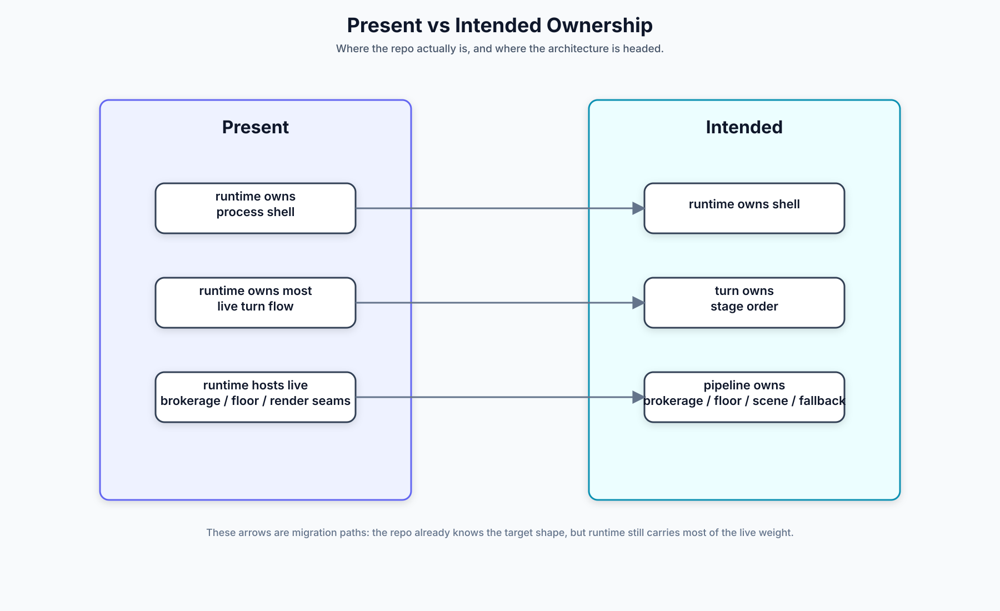

# Migration Appendix

The turn/pipeline ownership migration has landed in production code. This
appendix keeps the comparison artifact for historical and review context.

Primary closeout reference:

- [`requirements/turn-pipeline-refactor.md`](../../requirements/turn-pipeline-refactor.md)

Practical reading:

- `runtime` acts as house shell and adapter wiring.
- `turn` owns stage order and commit semantics.
- `pipeline` owns conversational transforms.

Legacy render variants are kept in [`diagrams/archive/`](diagrams/archive).

## Canonical-State Migration Workloads

This appendix tracks operator-facing migration workloads required to align live
state behavior with the truth-class contract.

### Workload A: Truth-class contract ratification

- Keep every major surface classified as one of:
  - `canonical`
  - `projection`
  - `operational current-state store`
  - `compatibility fallback`
- Reject undocumented class terms for state-surface discussions.
- Keep `/status` and `/debug` wording consistent with class attribution.

Primary references:

- [`README.md`](./README.md)
- [`state-surfaces.md`](./state-surfaces.md)
- [`../../requirements/terminology.md`](../../requirements/terminology.md)
- [`../../requirements/sessions.md`](../../requirements/sessions.md)

### Workload B: Durable identity/config staging

- Current state:
  - `session.durable_agents` is canonical for durable child identity/config.
  - `session.durable_agent_state` is split:
    - identity/config-bearing fields are canonical.
    - runtime/apply/transient posture fields are operational current-state.
- Target direction:
  - Continue shrinking operational posture fields to strictly runtime/apply
    state (no identity leakage).
  - Keep source attribution explicit where canonical identity and operational
    posture are shown together.
- Operator check after upgrades:
  - verify durable identity claims in `/status` and `/debug` match canonical
    identity/config sources while runtime posture remains operational.

Primary references:

- [`state-surfaces.md`](./state-surfaces.md)
- [`canonical-state-and-autonomy-roadmap.md`](./canonical-state-and-autonomy-roadmap.md)

### Workload C: TES retention and fallback discipline

- Current state:
  - TES rows are retained indefinitely unless `DeleteSession` or `ResetRuntime`
    is used.
- Required migration behavior:
  - define explicit retention policy before pruning;
  - provide deterministic export/rollup before deleting old TES ranges;
  - keep `turn_runs` as compatibility fallback only (not canonical execution
    truth).
- Operator check after upgrades:
  - run `/status` and `/debug` and verify fallback is explicitly marked when
    used.

Primary references:

- [`transparent-execution-sequence.md`](./transparent-execution-sequence.md)
- [`../../requirements/operations.md`](../../requirements/operations.md)

## Validation Checklist

- `make docs-architecture`
- `go test ./...`
- manual runbook check:
  - startup/recovery
  - `/status` source-attribution wording
  - `/debug` source-attribution wording
  - decision and continuation pending-state visibility
  - durable wake projections
