# Package Ownership

## Runtime

`runtime` is the house shell.

- Owns transport ingress/egress, principal/scope/session wiring, and long-lived loops.
- Adapts concrete ports into `turn.Machine`.
- Does not own one-turn stage ordering.

Code anchors:

- [`runtime/runtime.go`](../../runtime/runtime.go)
- [`runtime/turn.go`](../../runtime/turn.go)
- [`runtime/maintenance_turn.go`](../../runtime/maintenance_turn.go)
- [`runtime/durable_group.go`](../../runtime/durable_group.go)

## Turn

`turn` is the one-turn state machine.

- Owns policy by run-kind.
- Owns stage order and commit/delivery orchestration contracts.
- Consumes governor/face/persistence/delivery ports supplied by runtime.

Code anchors:

- [`turn/engine.go`](../../turn/engine.go)
- [`turn/stages.go`](../../turn/stages.go)
- [`turn/policy.go`](../../turn/policy.go)
- [`turn/ports.go`](../../turn/ports.go)

## Pipeline

`pipeline` owns governor/face conversational transforms.

- Brokerage parsing and ratification shaping.
- Floor material extraction and fallback serialization.
- Visible-reply constitution validation and repair contract shaping.
- Render-decision policy helpers.

Code anchors:

- [`pipeline/contracts.go`](../../pipeline/contracts.go)
- [`pipeline/brokerage.go`](../../pipeline/brokerage.go)
- [`pipeline/material.go`](../../pipeline/material.go)
- [`pipeline/fallback.go`](../../pipeline/fallback.go)
- [`pipeline/constitution.go`](../../pipeline/constitution.go)

## Boundary Guards

- [`turn/dependency_guard_test.go`](../../turn/dependency_guard_test.go) enforces that `turn` does not depend on `runtime`.
- [`runtime/architecture_invariants_runtime_test.go`](../../runtime/architecture_invariants_runtime_test.go) pins floor/scene and persist-before-deliver behavior.

Related requirements:

- [`requirements/core.md`](../../requirements/core.md)
- [`requirements/governor.md`](../../requirements/governor.md)
- [`requirements/turn-pipeline-refactor.md`](../../requirements/turn-pipeline-refactor.md)

