# State Surfaces

Aphelion state is intentionally multi-surface.

## Surfaces

- Visible transcript ledger in `session` (`user`/`assistant` scene text).
- Floor sidecars and floor metadata attached per turn.
- Plan state and operation state sidecars.
- Review events and outbound delivery records.
- Turn-run recovery records for startup repair.
- Execution event timeline (`execution_events`) for ingress/turn/tool/delivery truth.

Code anchors:

- [`session/store.go`](../../session/store.go)
- [`runtime/turn_finalize.go`](../../runtime/turn_finalize.go)
- [`runtime/awareness.go`](../../runtime/awareness.go)
- [`turn/awareness.go`](../../turn/awareness.go)
- [`docs/architecture/transparent-execution-sequence.md`](./transparent-execution-sequence.md)

## Classification Matrix

Classifications below use the shared truth classes defined in
[`docs/architecture/README.md`](./README.md).

| Surface / Store | Classification | Canonical Question |
| --- | --- | --- |
| `session.execution_events` | canonical | What happened in runtime, in what order? |
| `session.messages` | canonical | What scene text was recorded for the session? |
| `messages.floor_content` | canonical | What floor text was captured alongside scene text at message-record time? |
| `messages.floor_metadata` | canonical | What floor metadata/artifact references were captured alongside scene text at message-record time? |
| `session.outbound_messages` | canonical | Which outbound deliveries were recorded at the transport ledger level (not guaranteed human render)? |
| `session.review_events (status='delivered')` | canonical | Which bounded review artifacts were shown to humans? |
| Parent/child memory files and `rhizome_*` tables | canonical | What durable meaning has been retained over time? |
| `session.durable_agents` | canonical | What durable-child identity/config is currently declared? |
| `session.durable_agent_state (identity/config-bearing fields)` | canonical | Which child identity/config handshake facts are currently declared? |
| `session.durable_agent_state (runtime/apply/transient posture fields)` | operational current-state store | What durable-child runtime/apply status is currently declared? |
| `sessions.last_floor_text` | operational current-state store | What floor text is currently declared for the active session? |
| `sessions.last_floor_metadata` | operational current-state store | What floor metadata is currently declared for the active session? |
| `sessions.plan_state_json` | operational current-state store | What plan intent is currently declared? |
| `sessions.operation_state_json` | operational current-state store | What operation intent/stage is currently declared? |
| `pending_decisions` | operational current-state store | What decisions are currently pending and actionable? |
| `sessions.continuation_state_json` | operational current-state store | What continuation state, embedded `ActionProposal`, and embedded `ContinuationLease` are currently declared? |
| `mission_ledger` candidate rows projected as pending items | projection | Which durable candidate missions should be visible for operator review now? |
| `session.review_events (status='pending')` | operational current-state store | Which review artifacts are queued for governance delivery? |
| `/status` | projection | How should system/chat state be rendered for operators now? |
| `/debug` | projection | How should execution evidence be rendered for diagnosis now? |
| Quick-read and progress render blocks | projection | What compact operator narration should be surfaced now? |
| `turn_runs` | compatibility fallback | What recovery/runtime hints are available when newer surfaces are incomplete? |

## Compatibility Fallback Invariants

- `compatibility fallback` rows (currently `turn_runs`) are migration/recovery
  support only.
- Fallback rows may answer a question only when matching canonical and
  operational current-state sources are missing or incomplete.
- Fallback rows must not silently override canonical or operational answers.
- When `/status` or `/debug` uses fallback rows, that usage should be surfaced
  as source attribution.

ActionProposal / ContinuationLease note:

- In v1 these records are embedded in `sessions.continuation_state_json` so the existing continuation button flow remains the operational current-state surface.
- TES `continuation.*` events remain canonical for what was offered, approved, consumed, revoked, or blocked at runtime.

Staged identity decision:

- `session.durable_agents` is canonical for durable child identity/config.
- `session.durable_agent_state` is split by meaning:
  - identity/config-bearing fields are canonical identity/config.
  - runtime/apply/transient posture fields remain operational current-state.

## Why This Matters

- Keeps user-visible continuity and machine-audit continuity separate.
- Preserves floor/scene split without losing recovery/review semantics.
- Prevents architecture drift into one hidden “memory blob.”
- Makes `/status`, `/debug`, and progress narration converge on one shared execution timeline instead of independent ad-hoc state machines.

Related requirements:

- [`requirements/sessions.md`](../../requirements/sessions.md)
- [`requirements/operations.md`](../../requirements/operations.md)
- [`requirements/hidden-inputs.md`](../../requirements/hidden-inputs.md)
- [`requirements/reliability.md`](../../requirements/reliability.md)
