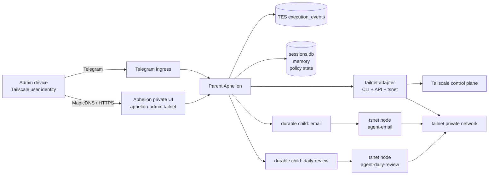
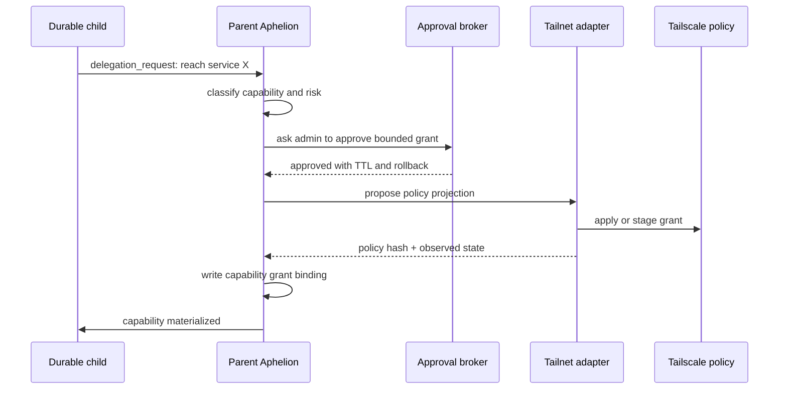

# Tailscale Agent Substrate Project

_Status: draft project plan._

This document describes what it would mean for Tailscale, especially `tsnet`,
to become a first-class Aphelion substrate.

The core idea is not "Aphelion can run `tailscale status`." The core idea is:

> Aphelion and durable children can become private tailnet participants with
> their own network identity, MagicDNS presence, grants, control surfaces,
> telemetry, and recovery behavior.

In that model, a durable child is no longer only a process with memory and a
tool envelope. It can be a governed network organ with a reachable private
surface and a policy-bound position in the tailnet.

## Why

Aphelion is already becoming a local operating substrate for agents:

- identity and principal resolution
- Telegram and other ingress surfaces
- durable children
- capability negotiation
- tool authorization
- execution logs through TES
- memory and semantic retrieval
- restart/reinstall recovery
- `/status` and `/doctor`
- admin approval and review surfaces

Tailscale has a parallel vocabulary at the network layer:

- tailnet identity
- node identity
- tags
- grants
- SSH rules
- device posture
- MagicDNS
- Serve and Funnel
- subnet routers and app connectors
- webhooks and logs
- Tailnet Lock
- `tsnet` application nodes

The project is to make these two vocabularies compose.

Aphelion should remain the governance, memory, approval, and agent-continuity
layer. Tailscale should become the private reachability and identity-aware
network layer.

## Non-goals

- Do not make tailnet membership equal admin authority.
- Do not expose public services by default.
- Do not require every deployment to use Tailscale.
- Do not make Aphelion depend on the Tailscale hosted control plane for its
  own constitutional truth.
- Do not hide Tailscale CLI or API mutations behind generic shell execution.
- Do not let durable children self-provision network surfaces without parent
  approval.

## Product Definition

First-class Tailscale support means Aphelion can answer and act on these
questions:

- What tailnet identities exist for the parent and each durable child?
- Which tailnet node or `tsnet` node backs a given agent?
- Which private services are exposed by Aphelion or a child?
- Which Tailscale grants correspond to an Aphelion capability grant?
- Which routes, SSH paths, app connectors, or Serve/Funnel surfaces are active?
- Are tailnet reality and Aphelion's declared authority model in sync?
- If the service restarts or is reinstalled, can the expected tailnet identity
  and child surfaces be recovered safely?
- Can an admin inspect, approve, revoke, or repair tailnet surfaces from
  Telegram and from a private tailnet UI?

## Current Checkpoint

The current implemented checkpoint is **declared durable-child tailnet
identity**, not live child materialization.

Implemented:

- durable-agent live policy fields:
  - `tailnet_mode`
  - `tailnet_hostname`
  - `tailnet_tags`
  - `tailnet_surface_policy`
- child profile projection into `policy.md`, `runtime.md`, and
  `surface-rules.md`.
- `/agents` and durable status projections showing child tailnet declarations.
- `tailnet_surfaces` registry rows for declared durable-child private status
  surfaces.
- `surface_declared_not_observed` diagnosis when a child surface is declared
  but no live node has been observed.
- preservation of future active/degraded/revoked child surfaces so declaration
  sync does not overwrite materialized state.

Not implemented yet:

- starting a child `tsnet` node.
- installing anything onto a remote child host.
- issuing or consuming per-child auth keys.
- writing Tailscale ACL/grant policy.
- public Serve/Funnel exposure.
- parent-to-child private RPC.

This gives Aphelion a safe intent layer: the system can say "this child should
have a private tailnet body" before it actually creates that body.

## User Flow

### Current durable-child flow

1. Admin creates or revives a durable child.
2. Aphelion records durable identity, policy, memory roots, bootstrap model, and
   channel config.
3. Profile sync writes parent-managed files into the child memory layer.
4. The child wakes through existing Aphelion surfaces such as Telegram, email,
   daily review, scheduler, or parent conversation.
5. If the child needs more authority, it submits a delegation or capability
   request.
6. Admin approves, rejects, or asks for a narrower request from Telegram.
7. Debugging happens through `/status`, `/doctor`, logs, profile files, review
   artifacts, and memory.

### Declared tailnet identity flow

1. Admin or parent policy declares that a child should have a tailnet identity.
2. Aphelion stores the declaration in durable-agent live policy.
3. Profile sync writes the declared hostname, tags, and surface policy into the
   child profile.
4. `/agents`, `/status durables`, and `/tailnet surfaces` show the declaration.
5. The tailnet registry records the child status surface as `declared`.
6. Until an actual child node is observed, `/doctor` and tailnet status can
   report `surface_declared_not_observed`.
7. If the surface is revoked, registry reconciliation preserves the revocation
   instead of silently redeclaring it active.

### Future live child materialization flow

1. Admin asks to materialize a declared child.
2. Aphelion proposes:
   - target host.
   - child agent id.
   - MagicDNS hostname.
   - tags.
   - local state path.
   - exposed private surfaces.
   - installer/update channel.
   - rollback plan.
3. Admin approves the materialization decision.
4. Aphelion provisions or instructs installation on the target host.
5. The child process starts with its own state directory and `tsnet` identity.
6. The child exposes only the approved private status/control surface.
7. Parent observes the child over the tailnet and marks the surface `active`.
8. Child capability claims are gated on both Aphelion grants and observed
   tailnet materialization.
9. Reinstall/restart recovery checks whether the child identity is still present
   before the child claims network reachability.

### User flow delta

Compared with today's flow:

- A child gains an inspectable private network identity, not just a durable
  SQLite/profile identity.
- Child existence becomes observable as `declared`, `active`, `degraded`, or
  `revoked`.
- Admins can distinguish "policy says this child should exist" from "the
  private node is actually reachable."
- Expansion requests can include network surfaces, host placement, tags, or
  private services instead of only abstract capability grants.
- Reinstall recovery has one more truth to reconcile: declared child identity
  versus actual tailnet node state.

## Use Case Map

There are two distinct classes of use case:

1. **Aphelion extended by Tailscale.** Tailscale becomes part of Aphelion's
   runtime body: identity, reachability, private surfaces, distributed child
   placement, and live operator experience.
2. **Aphelion managing Tailscale.** Aphelion treats Tailscale as an external
   system to inspect, diagnose, reconcile, or mutate through governed tools.

The first class is the direction-setting project. The second class is support
tooling that makes the first class reliable.

### A. Aphelion Extended By Tailscale

These are the primary use cases because they change what Aphelion is.

#### 1. Parent Aphelion as a tailnet node

Parent Aphelion runs an embedded `tsnet` node with a stable hostname such as
`aphelion-admin`, a persistent state directory, and expected tags.

How it works:

- On startup, Aphelion initializes a `tsnet` server if the config enables it.
- It verifies that the observed node identity matches the expected tailnet,
  hostname, and tags.
- It registers parent-owned private surfaces against this node.
- `/status`, `/doctor`, and startup recovery report whether this node is
  healthy or drifted.

This is the root of the project: Aphelion stops being only a local process and
becomes a private network participant.

#### 2. Private admin control plane

Aphelion exposes a tailnet-only web control surface for status, doctor reports,
decisions, logs, artifacts, and agent health.

How it works:

- The control plane binds to the parent `tsnet` listener, not a public socket.
- Tailscale identity is used as request evidence.
- Aphelion still checks local admin admission before showing privileged actions.
- Sensitive actions still use Aphelion decisions and approval records.

Telegram remains the interruptible command lane; the private web UI becomes the
high-bandwidth inspection lane.

#### 3. Durable child as a tailnet node

A durable child can have its own `tsnet` identity, MagicDNS hostname, tags, and
private status or RPC endpoint.

How it works:

- The durable-agent policy declares `tailnet_mode`, hostname, tags, and allowed
  surface kinds.
- Child profile files include the current tailnet identity and boundaries.
- Reinstall/reconcile logic verifies that the child node exists before the child
  claims network capability.
- The parent can revoke or disable the child surface without deleting the child
  memory.

This makes child identity material: a child can be addressed and bounded as a
network participant, not just as a row in SQLite.

#### 4. Agent network body

An agent's runtime identity includes memory, tool scope, policy, and private
network presence.

How it works:

- Agent status includes local process state, durable memory state, tool grants,
  and tailnet node state.
- Network reach is treated as materialized capability, not ambient internet.
- Agent wake/recovery checks include whether expected private services are
  reachable.
- Capability claims are grounded against both Aphelion grant records and
  observed tailnet reachability.

This is the conceptual bridge: Tailscale gives the agent a body in the private
network, while Aphelion gives that body judgment and limits.

#### 5. Remote child hosting

Durable children can run on other machines while remaining governed by parent
Aphelion.

How it works:

- A remote child process joins the tailnet with its own `tsnet` node or tagged
  device identity.
- The parent communicates with it through a private control endpoint instead of
  only local child-run execution.
- The child keeps local memory and workspace roots on its host.
- The parent owns policy, grants, review artifacts, recovery expectations, and
  upgrade/reconcile instructions.

This enables a child to live near the hardware, files, service, or network it
needs without making it independent of the parent.

#### Supported remote child forms

Remote children should not all be forced into the same runtime shape. Aphelion
should support three forms, in increasing order of local autonomy.

##### 1. Parent-orchestrated remote child

This is the lightest remote form. The child host has Tailscale, Codex, a
workspace, and Aphelion-managed memory/profile files. The parent reaches the
host over the tailnet, starts a Codex run with the child's profile and policy,
collects artifacts/status, and records the result in the parent session.

What runs on the child host:

- Tailscale daemon or Tailscale SSH.
- Codex CLI/runtime.
- Child workspace and memory/profile files.
- Optional local tools already present on the host.

What does not run on the child host:

- no long-lived Aphelion child process.
- no child private HTTP control plane.
- no autonomous local scheduler unless separately configured.

Use this when the main need is "do work near this host, filesystem, device, or
private service" and the parent can remain the scheduler/governor.

##### 2. Semi-living remote child

This form adds a tiny local launcher but still avoids a full Aphelion child
binary. The host has a systemd timer, cron job, launch agent, or signed wrapper
that checks a parent-managed inbox, runs Codex with the child's profile, writes
status/artifacts, and exits.

What runs on the child host:

- everything from parent-orchestrated mode.
- a small launcher or scheduled wrapper.
- local inbox/outbox paths or a private tailnet endpoint for work packets.

What this enables:

- periodic reports even if the parent does not actively SSH in.
- bounded local autonomy.
- simpler deployment than a full child control plane.

Use this when the child should wake itself occasionally but does not need rich
local queues, live RPC, or independent long-running services.

##### 3. Fully living governed child

This form runs `aphelion` in child mode, an `aphelion-child` binary, or an
equivalent supervised service. It has its own local control loop, private
tailnet status/control surface, policy/profile sync, health reporting, and
reconnect/update behavior.

What runs on the child host:

- child-mode Aphelion runtime.
- local state, memory, workspace, and profile roots.
- child `tsnet` node or tagged Tailscale identity.
- private `/status` and optional parent-child RPC surface.
- signed updater or supervised service manager.

What this enables:

- durable local lifecycle.
- richer status and doctor evidence.
- local queueing and reconnect.
- governed upward negotiation even while remote.
- safer long-lived delegation of host-adjacent work.

Use this when the child is a stable private network participant with continuing
responsibilities and enough value to justify installation and update machinery.

The first implementation after declarations should prefer form 1 unless the
target use case specifically requires form 2 or 3. Form 1 proves the highest
value assumption with the smallest remote footprint: Aphelion can safely animate
Codex on a tailnet-reachable host while keeping governance in the parent.

#### Child host access model

The parent agent should access a child host through explicit, typed lanes rather
than ambient SSH or shell:

- **Bootstrap lane:** a one-time install command or installer bundle approved by
  the admin and run on the child host by a trusted operator or by an approved
  remote execution grant.
- **Control lane:** parent-to-child HTTPS/RPC over tailnet, bound to the child's
  MagicDNS name and Aphelion child identity.
- **Observation lane:** child `/status`, health, profile hash, policy hash,
  version, and tailnet node evidence reported to parent.
- **Repair lane:** typed `tailnet_ssh_exec` or host command grants only after an
  explicit decision, with command preview, target host, risk class, and rollback
  plan.

The parent should not treat tailnet reachability as authority. Tailnet identity
is evidence that the request came from the expected private node; Aphelion still
checks durable child policy, capability grants, parent/admin admission, and
decision records.

#### Full child host installation model

A fully living child host should receive the smallest runtime needed to
materialize the declared child:

- `aphelion-child` or the main `aphelion` binary in child mode.
- a child-specific config file containing:
  - parent control endpoint.
  - child agent id.
  - expected parent identity.
  - local memory/workspace/state roots.
  - tailnet mode, hostname, tags, and approved surfaces.
- a persistent state directory, for example
  `~/.aphelion/children/<agent_id>/`.
- a service unit if the host should keep the child alive across reboots.
- bootstrap secret or enrollment token with a short TTL and narrow scope.
- optional local adapters needed by that child, installed as declared packages or
  tool manifests rather than ad hoc code.

The child host should not receive parent-wide secrets, admin Telegram tokens, or
unbounded write access to Aphelion's main state. Remote children should be
treated as scoped workers with their own memory, state, and network identity.

#### Signing and update model

The update model should make the host able to prove what it is running:

- Build Aphelion release artifacts with a manifest that records version,
  commit, platform, SHA-256 checksum, and signing identity.
- Sign release manifests with the project release key.
- The child launcher verifies manifest signature and artifact checksum before
  installing or replacing a binary.
- The child reports binary version, commit, manifest hash, policy hash, profile
  manifest hash, and tailnet node identity in `/status`.
- Parent `/doctor` compares expected versions and hashes against observed child
  reports.
- Updates are staged through an Aphelion decision:
  - proposed version.
  - diff or changelog summary.
  - affected children.
  - compatibility checks.
  - rollback artifact.
  - restart behavior.
- Child updates are applied one child at a time unless an admin approves a batch.
- If verification fails, the child keeps the previous binary and reports
  `degraded` instead of running unsigned code.

Tailscale identity can strengthen this but should not replace artifact signing.
Tailnet Lock can help constrain which node keys are trusted by the tailnet, while
Aphelion release signatures constrain which software a child is allowed to run.

#### 6. Agent-to-agent private RPC

Parent and children can communicate through private tailnet endpoints with
explicit authority checks.

How it works:

- Each participating agent exposes a minimal private RPC endpoint.
- Calls include caller identity evidence, requested action, and correlation ID.
- The receiver checks Aphelion grants and local policy before acting.
- TES records the call intent, authorization result, and response summary.

This creates a path for durable children to collaborate without turning every
interaction into a Telegram-style review relay.

#### 7. Private artifact surface

Reports, PDFs, logs, generated files, child artifacts, and review bundles can be
browsed privately over the tailnet.

How it works:

- Artifact references already tracked by Aphelion get private URLs.
- The private UI reads from allowed workspace and memory roots.
- Access control checks the requesting admin and artifact retention policy.
- Telegram can send a compact summary plus tailnet link instead of forcing
  long text or large files through chat.

This solves the repeated Telegram bottleneck: some outputs are better inspected
as private web artifacts.

#### 8. Private live work surface

Long-running Aphelion work can stream progress, logs, intermediate files, and
child execution state over a private tailnet page.

How it works:

- The existing progress/TES stream feeds a server-sent-events or websocket
  endpoint on the private UI.
- Telegram receives milestone summaries and interrupt controls.
- The private UI shows full step detail, active tools, logs, and produced
  artifacts.
- Stop/reassess controls remain governed by the same decision/control records.

This keeps Telegram concise while preserving observability for serious work.

#### 9. Tailnet-aware principal evidence

Tailnet user, device, and tag identity can strengthen principal resolution
without replacing Aphelion admission.

How it works:

- Private HTTP requests carry tailnet-derived identity evidence.
- Aphelion maps that evidence to known principals or marks it unknown.
- Admin-only actions still require an admitted Aphelion admin.
- `/doctor` reports identity mismatches and unknown tailnet callers.

The rule remains: Tailscale can prove where a request came from; Aphelion
decides what that requester may do.

#### 10. Trusted device approvals

Sensitive approvals can require both an admitted admin and a recognized
tailnet device.

How it works:

- Approval policy can require `telegram_admin && trusted_tailnet_device`.
- Telegram approval may be paired with a tailnet UI confirmation for high-risk
  actions.
- Device posture can become one signal in the approval record.
- Failed posture or unknown device identity downgrades the action to
  "requires stronger approval."

This is useful for destructive actions, public exposure, SSH, or policy writes.

#### 11. Private webhook ingress

Internal services can send events to Aphelion without exposing public HTTP
endpoints.

How it works:

- The parent `tsnet` node exposes private webhook endpoints.
- Each webhook source is bound to a tailnet identity, token, or both.
- Events become inbound messages, review events, or maintenance facts.
- Unknown or unauthorized senders are logged and surfaced without executing
  their requested actions.

This makes private automation practical without opening Aphelion to the public
internet.

#### 12. Private service surfaces

Agents can use named tailnet-reachable services such as dashboards, local APIs,
dev servers, databases, NAS shares, or home services.

How it works:

- A service is declared as a capability target with host, port, protocol,
  owner, and allowed actions.
- A child requests access through the delegation lane.
- If approved, Aphelion materializes a capability grant and, later, a tailnet
  grant or app capability projection.
- Reachability probes verify that the service is accessible before the child
  claims it can use the service.

This turns private services into governed agent organs rather than ambient
network assumptions.

#### 13. Distributed recovery

After restart, reinstall, or host migration, Aphelion can recover expected
tailnet identities and private surfaces as part of runtime continuity.

How it works:

- Startup recovery checks parent and child tailnet declarations.
- Expected node identity, hostname, tags, and state directories are compared
  with observed Tailscale state.
- Missing or mismatched surfaces are recorded as recovery issues.
- The system refuses to silently recreate high-risk surfaces like Funnel,
  routes, or SSH access.

This extends the existing memory/recovery goal into the private network layer.

#### 14. Tailnet-backed operator presence

Aphelion can use trusted admin device presence as one signal for alerting,
waiting, escalation, or active-window behavior.

How it works:

- Aphelion observes whether configured admin devices are online.
- Presence influences notification strategy, not core authority.
- A serious alert may be sent immediately if a trusted device is online, or
  summarized/deferred if the operator is unreachable.
- `/status` and `/doctor` show presence evidence and when it was last observed.

This lets Aphelion become less blind about operator availability.

#### 15. Ephemeral experiment agents

Temporary agents can receive short-lived `tsnet` identities for risky trials,
benchmarks, or isolated experiments.

How it works:

- An experiment request creates an ephemeral child profile and tailnet surface.
- The node gets bounded tags, TTL, storage roots, and explicit teardown.
- The experiment can expose private reports or metrics to the parent UI.
- Expiry revokes the surface and archives the evidence.

This gives experiments a real network identity without promoting them into
standing durable children.

### B. Aphelion Managing Tailscale

These are supporting use cases. They are valuable, but they should not distract
from the deeper goal of making Aphelion tailnet-native.

#### 1. Tailnet doctor

Aphelion diagnoses Tailscale health and explains what is broken.

How it works:

- `/doctor` gathers CLI/API state, daemon status, node identity, MagicDNS,
  Serve/Funnel, SSH, routes, app connectors, and policy evidence.
- It compares observed state with Aphelion declarations.
- It labels each issue as active, likely fixed, residual risk, or unknown.
- It proposes concrete repairs without applying mutations by default.

This gives the operator one place to see whether the network body is healthy.

#### 2. Grant reconciliation

Aphelion compares its capability grants with Tailscale grants or policy rules.

How it works:

- The grant binding table records which Aphelion grant should correspond to
  which tailnet reachability rule.
- Reconciliation checks whether the tailnet rule exists, is too broad, is too
  narrow, expired, or unmanaged.
- Drift becomes a status/doctor issue and can optionally become a Telegram
  alert.
- Repairs are proposed as policy diffs.

This prevents the two authority models from silently diverging.

#### 3. Policy diff review

Aphelion can generate Tailscale policy diffs from approved Aphelion grants and
ask the admin before applying them.

How it works:

- A grant approval produces a desired tailnet policy projection.
- Aphelion renders a human-readable diff with source, destination, ports,
  app capabilities, risk class, TTL, and rollback.
- The admin approves or denies the policy change.
- If applied, TES records policy hash, tool result, and verification.

This keeps policy changes reviewable instead of hiding them behind automation.

#### 4. Network drift detection

Aphelion alerts when tailnet state exists outside its declared model.

How it works:

- Periodic checks compare observed nodes, tags, routes, SSH rules, Serve/Funnel,
  and grants against Aphelion declarations.
- Unknown public exposure is high severity.
- Unknown private surfaces are medium severity until classified.
- Known intentional unmanaged state can be acknowledged or imported as a
  declaration.

This is the network equivalent of noticing untracked files or unmanaged tools.

#### 5. Remote repair through Tailscale SSH

Aphelion can run approved diagnostics or repairs on trusted tailnet hosts.

How it works:

- A remote command is classified by risk: read-only, mutation, destructive, or
  privilege-sensitive.
- The target host/user and command are shown in the approval prompt.
- Execution uses a typed `tailnet_ssh_exec` tool, not raw shell improvisation.
- TES records the command shape, approval, output preview, and result.

This is powerful enough that it should land after identity, grants, and drift
detection exist.

#### 6. Temporary Funnel sharing

Aphelion can enable public sharing only as a high-risk, TTL-bound operation.

How it works:

- The requested service is tied to an existing private surface.
- Aphelion explains the public exposure, TTL, rollback, and expected audience.
- Admin approval is required.
- Expiry disables the Funnel and alerts if teardown fails.

This should be treated as exception handling, not a default product path.

#### 7. Route and app connector management

Aphelion can inspect or propose subnet routes and app connectors for services
agents need.

How it works:

- Read-only diagnosis lands first: which routes exist, who advertises them, and
  whether they are approved.
- A child can request reachability to a private resource.
- Aphelion proposes the smallest route/app connector needed.
- Mutations require explicit approval and verification.

This lets agents reach internal resources without granting broad network access.

## Feature Map

| Aphelion surface | Tailscale surface | Integration meaning |
| --- | --- | --- |
| Principal identity | User, node, tag identity | Tailnet user/device/tag becomes evidence for principal resolution, never sole authority. |
| Durable agent registry | `tsnet` node, tagged device | Each child can have a private network identity and MagicDNS name. |
| Capability grant | Tailnet grant | Network reach can be materialized as a policy projection of an approved Aphelion grant. |
| Tool sandbox | Tailnet reachability | Tool network egress can be constrained to named tailnet services and tags. |
| Remote execution | Tailscale SSH | SSH is a governed remote execution tool with TES audit and approval gates. |
| Review artifacts | Tailnet webhooks/logs | Tailscale events become child/parent review material and `/doctor` evidence. |
| Admin UI | `tsnet`, Serve, `tsidp` | Private web status, approvals, logs, and doctor reports are reachable only on the tailnet. |
| Public share | Funnel | Public exposure is a high-risk, TTL-bound approval with rollback. |
| Reinstall recovery | Auth keys, node state, tags | Aphelion verifies expected tailnet identity before resuming private surfaces. |
| Tool installation | App connectors, subnet routers | Network paths to internal/cloud/SaaS resources are declared and governed. |
| TES | Tailscale API and logs | Node joins, policy changes, SSH attempts, and service exposure changes are execution events. |

## Target Architecture

The long-term shape has four layers:

1. **Tailnet substrate adapter**
   - Wraps local Tailscale CLI, Tailscale API, webhooks, and `tsnet`.
   - Presents a stable Aphelion interface.

2. **Tailnet authority model**
   - Stores declared Aphelion tailnet intent.
   - Reconciles it with observed Tailscale state.
   - Emits drift into TES, `/status`, `/doctor`, and Telegram alerts.

3. **Agent network surfaces**
   - Parent Aphelion has a tailnet node or embedded `tsnet` node.
   - Durable children can have their own embedded `tsnet` nodes or tagged
     runtime nodes.
   - Each surface has explicit owner, retention, grants, and teardown rules.

4. **Private control plane**
   - Tailnet-only HTTP endpoints for status, doctor, approvals, child reports,
     artifact inspection, and service health.
   - Telegram remains the default admin command surface, but the tailnet UI
     becomes the richer local control surface.



## Authority Model

The central invariant:

> Tailscale grants reachability. Aphelion grants authority.

Network access is a material capability, not a user-facing permission by
itself. Aphelion must still decide whether a principal may use that reachability
for a particular action.

Examples:

- A child may be able to reach `grafana.tailnet`, but still lack authority to
  query production dashboards.
- A remote command may be reachable through Tailscale SSH, but still require an
  Aphelion destructive-change approval.
- A private admin UI request may arrive from a valid tailnet user, but still
  require an admitted Aphelion admin principal.

### Truth Classes

| Question | Source | Truth class |
| --- | --- | --- |
| What Aphelion intends to expose | Aphelion tailnet declarations | operational current-state store |
| What Tailscale currently exposes | Tailscale CLI/API observation | operational current-state store |
| What actually happened in a turn | TES | canonical |
| What the user saw | session messages + outbound ledger | canonical/projection by surface |
| What policy should be applied | Aphelion config + capability grants | operational current-state store |
| What tailnet policy is deployed | Tailscale API | operational current-state store |

## Proposed Code Shape

Package names are intentionally tentative. Prefer `tailnet` over `tailscale` to
avoid import confusion with `tailscale.com/...`.

```text
tailnet/
  backend.go              # interface: status, nodes, whois, ping, serve, ssh, policy
  cli_backend.go          # tailscale CLI adapter
  tsnet_server.go         # embedded parent/child tsnet node manager
  api_backend.go          # Tailscale API for policy, webhooks, nodes
  fake_backend.go         # deterministic tests
  policy_projection.go    # Aphelion grants -> tailnet policy proposals
  diagnostics.go          # doctor/status data model

runtime/
  tailnet_status.go       # /status projection
  tailnet_doctor.go       # /doctor evidence collection
  tailnet_reconcile.go    # startup/reinstall reconciliation
  tailnet_ui.go           # private control-plane handler registration

tool/
  tailnet.go              # governed tailnet tools
  tailnet_test.go

durableagent/
  tailnet.go              # child tailnet identity/surface declarations

telegram/
  tailnet_commands.go     # /tailnet command UI and callbacks
```

## Configuration

Initial config should be explicit and conservative.

```toml
[tailscale]
enabled = true
mode = "hybrid" # cli | tsnet | hybrid
expected_tailnet = "example.ts.net"
state_dir = "~/.aphelion/state/tailnet"
alert_on_drift = true

[tailscale.parent]
enabled = true
hostname = "aphelion-admin"
auth_key_env = "APHELION_TS_AUTHKEY"
tags = ["tag:aphelion-admin"]
serve_admin_ui = false
funnel_enabled = false

[tailscale.children]
default_mode = "disabled" # disabled | tsnet | tagged_node
hostname_prefix = "agent-"
allow_child_serve = false
allow_child_funnel = false

[tailscale.ssh]
enabled = false
default_action = "approval_required"
allow_root = false

[tailscale.policy]
manage_grants = "propose" # observe | propose | apply_with_approval
manage_ssh = "propose"
manage_serve = "propose"
manage_funnel = "approval_required"
```

Secrets must not live in plain config. Auth keys should come from environment,
secret files, or a future Aphelion secret store.

## Data Model

New tables can start small and grow only when needed.

### `tailnet_nodes`

Observed node inventory.

```text
id
node_id
name
dns_name
tailscale_ips_json
user
tags_json
online
last_seen_at
observed_at
raw_json
```

### `tailnet_surfaces`

Declared surfaces Aphelion owns.

```text
id
owner_kind          # parent | durable_agent | tool | service
owner_id
surface_kind        # tsnet_http | serve | funnel | ssh | route | app_connector
hostname
port
path
visibility          # tailnet_private | public_funnel | route_only
status              # declared | active | degraded | revoked
decision_id
created_at
updated_at
expires_at
```

### `tailnet_grant_bindings`

Connection between Aphelion capability grants and Tailscale policy.

```text
id
capability_grant_id
source_selector
destination_selector
ip_permissions_json
app_capabilities_json
tailscale_policy_hash
status              # proposed | applied | drifted | revoked
last_verified_at
```

### `tailnet_events`

Optional cache of webhook/API events. TES remains canonical for Aphelion turns;
this table is an observed tailnet event inbox.

```text
id
event_type
source
node_id
actor
payload_json
observed_at
processed_at
```

## Governed Tools

Tailscale operations should be tools with typed contracts, not arbitrary shell
snippets.

Read-only tools:

- `tailnet_status`
- `tailnet_nodes`
- `tailnet_whois`
- `tailnet_ping`
- `tailnet_netcheck`
- `tailnet_policy_read`
- `tailnet_serve_status`
- `tailnet_ssh_check`

Mutation tools:

- `tailnet_start_parent_node`
- `tailnet_start_child_node`
- `tailnet_apply_policy`
- `tailnet_enable_serve`
- `tailnet_disable_serve`
- `tailnet_enable_funnel`
- `tailnet_disable_funnel`
- `tailnet_ssh_exec`
- `tailnet_route_advertise`
- `tailnet_route_withdraw`

Mutation tools require explicit approval unless they are part of a previously
ratified setup or recovery flow.

High-risk mutations:

- Funnel
- subnet route advertisement
- exit node advertisement
- SSH execution
- policy apply
- auth key generation or use
- Tailnet Lock signer changes

## Capability Grant Reconciliation

Aphelion already has a capability-delegation lane. Tailnet grants should become
a materialization target for that lane.



The parent should compare four states:

1. requested capability
2. approved Aphelion grant
3. projected Tailscale policy
4. observed reachability

If they diverge, `/doctor` and Telegram should say which layer is wrong.

## Private Control Plane

The private control plane is a tailnet-only HTTP service owned by parent
Aphelion.

Fast endpoints:

```text
GET  /status
GET  /doctor/latest
POST /doctor/run
GET  /tailnet
GET  /tailnet/nodes
GET  /tailnet/surfaces
GET  /tailnet/grants
GET  /agents
GET  /agents/{id}
POST /decisions/{id}/approve
POST /decisions/{id}/deny
POST /tailnet/surfaces/{id}/revoke
```

Authentication options, in order:

1. Tailnet-only listener with `tsnet`.
2. Tailscale identity headers via Serve when applicable.
3. Optional `tsidp` OIDC for stronger web sessions.
4. Aphelion session/decision tokens for sensitive actions.

The private UI should not replace Telegram initially. It should complement it:
Telegram remains the interruptible admin lane; the tailnet UI is for richer
inspection and durable operation.

## UI Surfaces

### Telegram

Commands:

- `/tailnet` - compact status and controls
- `/tailnet nodes` - observed nodes with tags and online state
- `/tailnet surfaces` - parent and child private services
- `/tailnet grants` - Aphelion grants mapped to Tailscale grants
- `/tailnet doctor` - focused tailnet diagnosis
- `/tailnet start` - setup wizard
- `/tailnet revoke <surface>` - revoke active Serve/Funnel/route/SSH surface

Inline controls:

- Start parent tsnet node
- Start child tsnet node
- Approve policy projection
- Revoke surface
- Run netcheck
- Ping node
- Open private UI link

Telegram warnings:

- Aphelion node identity mismatch
- child tsnet node failed to start
- MagicDNS broken
- Serve/Funnel unexpectedly active
- auth key expired
- route advertised but not approved
- Tailscale SSH reachable but Aphelion grant missing
- Tailscale grant exists with no Aphelion binding

### `/status`

Add a `tailnet` section:

```text
tailnet:
  mode: hybrid
  parent_node: aphelion-admin
  tailnet: example.ts.net
  status: healthy
  surfaces: 2 active, 0 public
  grants: 3 bound, 0 drifted
  child_nodes: 2 active, 1 disabled
```

### `/doctor`

Add tailnet diagnosis:

- installed CLI and version
- `tailscaled` daemon state
- parent `tsnet` state
- expected vs observed tailnet
- tags and node identity
- MagicDNS resolution
- Serve/Funnel state
- SSH policy state
- route/app connector state
- capability grant bindings
- recent tailnet drift events
- recommended fixes

### Private Web UI

First useful screens:

- Overview
- Agents and tailnet identities
- Tailnet surfaces
- Grant bindings
- Recent tailnet events
- Decisions needing approval
- Doctor report

## Incremental Delivery Plan

This is the practical implementation order. The critical spine is:

> read-only awareness -> parent `tsnet` node -> private UI -> surface registry
> -> child `tsnet` node -> private RPC -> grant bindings -> policy/drift/mutations

Each step should be shippable, testable, and useful on its own.

### 1. Tailnet Config And Backend Interface

Deliverable: Aphelion can be built and tested with Tailscale support disabled,
enabled, or mocked.

Build:

- `[tailscale]` config structs and validation.
- `tailnet.Backend` interface.
- fake backend for unit tests.
- runtime feature flag defaults that keep the system unchanged when disabled.

Tests:

- config parse/validation tests.
- fake backend contract tests.
- runtime starts cleanly when Tailscale is disabled.

### 2. Read-only Tailnet Awareness

Deliverable: `/status` and `/doctor` can say whether the host is tailnet-ready.

Build:

- CLI backend for `tailscale version`, `status --json`, `ip`, `netcheck`,
  `whois`, and `ping` where available.
- normalized diagnostic model.
- basic tailnet section in `/status`.
- `/doctor` evidence block for daemon state, node identity, IPs, DNS, and tags.

Tests:

- parser golden tests for Tailscale CLI JSON.
- missing CLI/daemon tests.
- doctor issue classification for missing or mismatched tailnet state.

### 3. Telegram `/tailnet` Read-only Command

Deliverable: the admin can ask what Aphelion knows about its tailnet body.

Build:

- `/tailnet` command.
- compact rendering of node identity, online state, tailnet name, IPs, tags,
  MagicDNS hints, and obvious drift.
- inline controls for refresh and focused doctor run.

Tests:

- command routing tests.
- Telegram rendering tests under healthy, disabled, and degraded states.

### 4. Parent `tsnet` Node MVP

Deliverable: parent Aphelion has a private MagicDNS identity.

Build:

- embedded parent `tsnet` server wrapper.
- persistent state under `~/.aphelion/state/tailnet/parent`.
- parent hostname and auth-key config.
- lifecycle events in TES.
- startup recovery check for expected identity.

Tests:

- lifecycle tests with fake `tsnet` implementation.
- state directory reuse test.
- mismatch and missing auth-key tests.

### 5. Tailnet-only Health Endpoint

Deliverable: first proof that Aphelion is reachable as a private tailnet
service.

Build:

- minimal HTTP mux on the parent `tsnet` listener.
- `GET /healthz`.
- `GET /status`.
- `GET /tailnet`.
- Telegram `/tailnet` link to the MagicDNS URL when available.

Tests:

- HTTP handler tests without real Tailscale.
- authorization defaults: health can be shallow, status requires admin identity
  or local configured allowance.

### 6. Tailnet Surface Registry

Deliverable: Aphelion can track which private network surfaces it owns.

Build:

- `tailnet_surfaces` table.
- parent private UI surface record.
- lifecycle events for declared, active, degraded, revoked.
- `/tailnet surfaces`.
- revoke/disable path for owned surfaces.

Tests:

- create/update/revoke store tests.
- status projection tests.
- revoke idempotency tests.

### 7. Private Admin UI MVP

Deliverable: Telegram stays concise while rich inspection moves to the private
UI.

Build:

- minimal HTML UI over parent `tsnet`.
- pages for overview, status, doctor latest, active turns, pending decisions,
  and tailnet surfaces.
- action buttons that call existing decision/control paths.
- no public exposure.

Tests:

- handler tests.
- authorization tests.
- decision button tests.
- UI smoke tests using the fake backend.

### 8. Durable Child Tailnet Declarations

Deliverable: a child can declare that it should have a tailnet identity without
starting one yet.

Build:

- durable-agent policy fields:
  - `tailnet_mode`
  - `tailnet_hostname`
  - `tailnet_tags`
  - `tailnet_surface_policy`
- profile sync for tailnet rules.
- `/agents` and `/tailnet` projections for declared child tailnet state.

Tests:

- durable-agent profile sync tests.
- policy ceiling tests.
- child cannot declare public surfaces without parent/admin policy.

### 9. Child Tailnet Reconcile

Deliverable: children stop claiming network capability unless it is actually
materialized.

Build:

- startup/reinstall reconciliation for child tailnet declarations.
- child profile guidance to verify tailnet identity before claiming network
  capability.
- doctor issue when declared child node is missing or unhealthy.

Tests:

- reinstall recovery test.
- missing child node test.
- stale child profile test.

### 10. Child `tsnet` Node MVP

Deliverable: first proof of "agent as private network participant."

Build:

- start one durable child as an embedded `tsnet` node.
- child-local state directory.
- child private `/status` endpoint.
- parent projection of child node health.
- no child Serve/Funnel/route mutations.

Tests:

- fake child `tsnet` lifecycle test.
- child state isolation test.
- child endpoint authorization test.

### 11. Parent-to-Child Private RPC

Deliverable: parent-child coordination can use private endpoints instead of
only local process calls or Telegram-style review.

Build:

- minimal RPC client/server contract.
- calls for status, wake, report, and capability check.
- caller identity evidence and correlation IDs.
- TES events for request, authorization, and result.

Tests:

- authorized parent call succeeds.
- unauthorized caller is rejected.
- RPC failure is surfaced as child health degradation.

### 12. Private Artifact Browser

Deliverable: large outputs stop fighting Telegram format and size limits.

Build:

- artifact index page.
- generated reports/PDF/logs links.
- retention and authority checks.
- Telegram summaries can link to tailnet artifact URLs.

Tests:

- path confinement tests.
- retention policy tests.
- private URL rendering tests.

### 13. Live Work Stream

Deliverable: long-running work is inspectable without spamming chat.

Build:

- server-sent-events or websocket feed from TES/progress events.
- active turn page.
- tool event, progress, final result, and artifact updates.
- Telegram sends milestone summaries and keeps stop/reassess controls.

Tests:

- stream event serialization tests.
- active turn projection tests.
- no secret-bearing hidden prompt leakage.

### 14. Tailnet-aware Principal Evidence

Deliverable: Aphelion can say that a private UI request came from a known
tailnet user/device while still enforcing Aphelion admission.

Build:

- identity evidence model for tailnet requests.
- mapping to Aphelion principals.
- unknown caller handling.
- status/doctor identity diagnostics.

Tests:

- admitted admin succeeds.
- known tailnet user without Aphelion admission cannot act.
- unknown tailnet caller is logged but not trusted.

### 15. Trusted Device Approval Policy

Deliverable: high-risk approvals can require both Aphelion admin identity and a
trusted tailnet device.

Build:

- approval policy extension.
- decision record includes tailnet identity evidence.
- UI/Telegram copy for "requires trusted device."
- downgrade/escalation behavior when the trusted device signal is absent.

Tests:

- destructive action requires trusted device when configured.
- ordinary action does not.
- approval evidence is persisted.

### 16. Grant Binding Model

Deliverable: Aphelion can represent "this child may reach this private service"
before mutating Tailscale policy.

Build:

- `tailnet_grant_bindings` table.
- binding from Aphelion capability grant to desired source/destination/ports.
- status projection: proposed, applied, drifted, revoked.
- doctor checks for missing or unmanaged bindings.

Tests:

- binding normalization tests.
- status projection tests.
- drift state tests with fake backend.

### 17. Policy Diff Generator

Deliverable: admins can review exact network implications before any tailnet
policy is applied.

Build:

- Tailscale policy read parser.
- desired-policy projection from grant bindings.
- human-readable diff.
- Telegram/private UI review surface.

Tests:

- golden diff tests.
- no broad wildcard grants without high-risk classification.
- unchanged policy produces no-op diff.

### 18. Drift Detection

Deliverable: `/doctor` can flag unmanaged or missing network surfaces.

Build:

- periodic or on-demand comparison of Aphelion declarations to Tailscale state.
- checks for nodes, tags, Serve, Funnel, SSH, routes, and grants.
- Telegram alerts for high-risk drift.

Tests:

- unmanaged Funnel is high severity.
- missing declared child node is active issue.
- acknowledged external state is not repeatedly noisy.

### 19. Approval-gated Policy Apply

Deliverable: Aphelion can materialize network grants safely.

Build:

- typed mutation tool for policy apply.
- approval prompt with diff, risk, TTL, and rollback.
- policy hash recording.
- post-apply verification.

Tests:

- apply requires approval.
- apply writes TES events.
- failed verification marks grant binding drifted.

### 20. Governed Tailscale SSH

Deliverable: remote repair becomes possible but audited.

Build:

- `tailnet_ssh_exec` typed tool.
- target host/user/command risk classifier.
- read-only, mutation, destructive, and privilege-sensitive approval modes.
- output preview and artifact capture.

Tests:

- read-only command can follow configured policy.
- destructive command requires explicit approval.
- target outside grant is denied.

### 21. Serve, Funnel, Routes, And App Connectors Last

Deliverable: public exposure and broad network changes are powerful but
controlled.

Build:

- Serve enable/disable.
- Funnel enable/disable with TTL and public-exposure warning.
- route/app connector observation first, mutation second.
- rollback monitors and Telegram alerts.

Tests:

- Funnel always requires high-risk approval.
- route advertisement requires explicit target and rollback.
- expired public exposure alerts and tears down.

## Fastest Route To Feature Complete

"Feature complete" here means: the parent can run as a private tailnet service,
durable children can receive tailnet identities, grants can be declared and
diagnosed, and the operator can control the system from Telegram and the private
tailnet UI.

### Milestone 0: Read-only Tailnet Awareness

Goal: Aphelion can see Tailscale.

Build:

- `tailnet.Backend` interface
- CLI backend for `tailscale status --json`, `netcheck`, `ip`, `whois`, `ping`
- config block
- `/status` section
- `/doctor` section
- Telegram `/tailnet` read-only command

Tests:

- fake backend unit tests
- JSON parser golden tests
- `/doctor` reports drift when expected tailnet/tag is absent

Verification gates:

- Disabled-by-default gate: `go test ./...` passes and runtime behavior is
  unchanged when `[tailscale]` is absent or disabled.
- Read-only safety gate: milestone 0 never executes mutating Tailscale commands
  such as `tailscale up`, `tailscale set`, `tailscale serve`,
  `tailscale funnel`, SSH, route changes, or policy writes.
- Parser/normalization gate: tests cover healthy `status --json`, missing CLI,
  daemon unavailable, unauthenticated daemon, malformed JSON, `ip`, and
  `netcheck` output.
- Telegram UI gate: `/tailnet` renders healthy, degraded, disabled, and missing
  daemon states as compact messages within Telegram limits, with a refresh
  control.
- Status/doctor gate: `/status` includes only a bounded tailnet summary, while
  `/doctor` includes evidence-rich diagnostics and concrete recommendations.
- Failure surfacing gate: missing or degraded Tailscale state is reported in
  Telegram/admin diagnostics without crashing startup or turn handling.
- Live smoke gate: when explicitly enabled, Aphelion's read-only snapshot is
  compared against local `tailscale status --json`, `tailscale ip`, and
  `tailscale netcheck` output on the host.

Environment:

- No environment variables are required for ordinary milestone 0 unit tests.
- Live smoke tests require `APHELION_TAILSCALE_INTEGRATION=1` and a host where
  the `tailscale` CLI is installed and intentionally available to the test
  process.
- Milestone 0 should not require a Tailscale auth key because it only observes
  existing daemon/CLI state.

Why first:

- Low risk.
- Gives diagnostics before mutations.
- Establishes data model and UI vocabulary.

### Milestone 1: Parent `tsnet` Node And Private Status UI

Goal: Aphelion becomes a tailnet node inside the Go process.

Build:

- `tailnet.TSNetServer` wrapper
- state directory under `~/.aphelion/state/tailnet/parent`
- parent hostname config
- tailnet-only HTTP mux
- `GET /status`, `GET /doctor/latest`, `GET /tailnet`
- Telegram link to MagicDNS URL when available

Tests:

- fake `tsnet` server lifecycle tests
- HTTP handler tests without real Tailscale
- startup/recovery tests for state directory reuse

Verification gates:

- Disabled-by-default gate: parent `tsnet` does not start unless explicitly
  configured or approved.
- Lifecycle gate: fake `tsnet` tests prove start, stop, restart, and state
  directory reuse.
- Identity gate: configured hostname, observed MagicDNS name, and persisted
  state match after restart; mismatches are surfaced in `/status`, `/doctor`,
  and Telegram.
- Private reachability gate: a tailnet-only `GET /healthz` or `GET /status`
  smoke test succeeds when integration tests are explicitly enabled.
- Auth-key safety gate: missing or expired auth-key material blocks startup of
  the parent node gracefully and never falls back to public exposure.

Environment:

- Ordinary milestone 1 unit tests use a fake `tsnet` implementation and require
  no secrets.
- Real `tsnet` integration tests require `APHELION_TAILSCALE_INTEGRATION=1`,
  `APHELION_TAILSCALE_TEST_AUTHKEY`, and a disposable test hostname such as
  `APHELION_TAILSCALE_TEST_HOSTNAME=aphelion-test`.
- The test auth key should be ephemeral, scoped to a test tailnet when possible,
  and never required for default CI.

Why second:

- This is the architectural hinge.
- It proves the private control plane without involving children yet.

### Milestone 2: Tailnet Surface Registry

Goal: Aphelion can declare and track network surfaces.

Build:

- `tailnet_surfaces` table
- parent surface record for private UI
- surface lifecycle events in TES
- `/tailnet surfaces`
- revoke flow

Tests:

- surface create/update/revoke tests
- status projection tests
- Telegram rendering tests

Why third:

- Durable children need the same lifecycle model.

### Milestone 3: Durable Child `tsnet` Identity

Goal: a child can have its own private tailnet presence.

Implemented substep:

- durable-agent policy fields:
  - `tailnet_mode`
  - `tailnet_hostname`
  - `tailnet_tags`
  - `tailnet_surface_policy`
- child profile files include tailnet identity and rules
- parent registry projection for declared child surfaces
- `/agents`, `/status durables`, and `/tailnet surfaces` show declarations
- missing observed child node is reported as declared but not observed

Remaining materialization substep:

- child `tsnet` state under child local state
- parent wake/reconcile verifies child tailnet materialization
- child review digest includes tailnet health when relevant

Tests:

- child profile sync tests
- child declaration registry tests
- child tailnet config inheritance tests
- child cannot start public surface without grant
- reinstall reconciliation test

Why fourth:

- This makes "agent as private network participant" real.

### Milestone 4: Grant Binding And Policy Projection

Goal: approved Aphelion grants can become Tailscale policy proposals.

Build:

- grant binding table
- policy projection engine
- read-only tailnet policy parser
- proposed policy diff rendering
- approval flow for apply
- drift detector

Tests:

- policy projection golden tests
- no broad wildcard grants without explicit admin approval
- stale grant detected after Tailscale policy changes

Why fifth:

- It ties Aphelion's capability model to Tailscale's access model safely.

### Milestone 5: Governed Remote Operations

Goal: SSH, Serve, Funnel, routes, and app connectors are first-class operations.

Build:

- `tailnet_ssh_exec` with approval classification
- Serve enable/disable tool
- Funnel enable/disable tool with public-exposure warning and TTL
- route/app connector observation first, mutation later
- operational alerts

Tests:

- destructive remote command requires approval
- Funnel requires high-risk approval and TTL
- route advertisement cannot happen from a child without parent grant
- all mutations write TES events

Why sixth:

- It is powerful and risky. It should land only after identity, surfaces, and
  grants are diagnosable.

## Test Surfaces

### Unit Tests

- CLI JSON parsing
- Tailscale API response parsing
- policy projection
- grant binding normalization
- risk classification
- Telegram renderers
- private HTTP handlers
- child profile tailnet files
- recovery reconciliation

### Integration Tests

Guard with an env var:

```text
APHELION_TAILSCALE_INTEGRATION=1
```

Integration cases:

- parent `tsnet` starts with a test hostname
- MagicDNS name resolves
- private HTTP endpoint returns status
- fake child starts and exposes a local test endpoint
- `tailscale ping` succeeds between test nodes

These should never run by default in CI unless a tailnet is explicitly
provisioned.

### Security Tests

- tailnet user without Aphelion admin admission cannot approve decisions
- tagged child cannot call parent admin mutation endpoint
- child cannot enable Funnel
- child cannot request broad `autogroup:internet` without high-risk review
- SSH as root requires explicit approval and policy allowance
- stale tailnet grant is reported as drift
- Tailscale policy grant without Aphelion binding is reported as unmanaged

### Recovery Tests

- parent tsnet state is reused after restart
- mismatch between configured hostname and observed node is surfaced
- missing auth key blocks startup gracefully
- recovered child has profile tailnet rules loaded before claiming capability
- expired route/app connector state is reported as unreachable or stale

## Security Posture

Defaults:

- parent private UI disabled until configured
- child tailnet nodes disabled until configured or approved
- Serve disabled by default
- Funnel disabled by default
- SSH disabled by default
- route advertisement disabled by default
- app connector mutation disabled by default
- policy writes default to "propose", not apply

Required approval classes:

| Action | Approval |
| --- | --- |
| Start parent private UI | admin approval or config ratification |
| Start child tsnet node | parent/admin approval |
| Apply Tailscale policy | admin approval |
| Enable Serve | admin approval unless pre-ratified |
| Enable Funnel | high-risk public exposure approval with TTL |
| Advertise subnet route | high-risk network mutation approval |
| Run Tailscale SSH command | remote execution approval |
| Run destructive SSH command | destructive mutation approval |

## Reinstall And First Install Story

On install/reinstall:

1. Load config.
2. Check whether Tailscale integration is enabled.
3. If enabled, inspect local daemon and parent `tsnet` state.
4. Verify expected tailnet, hostname, tags, and node identity.
5. Start parent private node only if config or approved setup says so.
6. Reconcile child tailnet declarations.
7. Surface any mismatch in Telegram and `/doctor`.
8. Do not silently create public surfaces.

The setup wizard should produce a report like:

```text
Tailnet setup ready.
- parent node: aphelion-admin
- mode: tsnet
- private UI: disabled
- child nodes: disabled by default
- policy writes: propose only
- next: approve starting the parent private UI
```

## Storyboards

### 1. Remote Admin Doctor

The admin is away from the machine. Aphelion is connected to the tailnet as
`aphelion-admin`.

1. Admin opens `https://aphelion-admin.<tailnet>/doctor`.
2. Tailnet identity proves the request came from a known admin device.
3. Aphelion still checks local admin admission.
4. The admin clicks "Run doctor."
5. The report is written to session history and also visible in Telegram.

### 2. Child Requests Private Service Access

The email child wants to inspect a private classifier service.

1. Child sends `delegation_request`.
2. Parent maps it to an Aphelion capability grant and a tailnet grant proposal.
3. Admin approves a 24-hour read-only service reachability grant.
4. Aphelion applies or stages Tailscale policy.
5. Child receives a materialized capability with host, port, allowed action, and
   rollback boundary.
6. `/doctor` can verify both policy and actual reachability.

### 3. Remote Repair Through SSH

Aphelion detects a stale service on a tagged node.

1. It proposes a Tailscale SSH command.
2. Telegram shows command details, host, user, risk class, and rollback plan.
3. Admin approves.
4. Aphelion executes through `tailnet_ssh_exec`.
5. TES records command start, finish, output preview, and result.

### 4. Temporary Public Funnel

The admin asks to share a demo.

1. Aphelion classifies Funnel as public exposure.
2. It requires high-risk approval with TTL.
3. It enables Funnel only for the approved local service.
4. It schedules expiry and rollback.
5. Telegram receives a warning if the Funnel remains active after TTL.

## Implementation Backlog

Fastest useful order:

1. Done: add `tailnet.Backend` and fake backend.
2. Done: add config structs and validation.
3. Done: add read-only CLI backend.
4. Done: add `/status`, `/doctor`, and `/tailnet` read-only projections.
5. Done: add parent `tsnet` node behind config.
6. Done: add private status UI.
7. Done: add `tailnet_surfaces` table.
8. Done: add child tailnet profile fields and declaration sync.
9. Next: materialize one declared child `tsnet` node with private status only.
10. Add grant binding and policy projection.
11. Add approval-gated mutations.
12. Add Tailscale webhook ingestion.
13. Add richer private UI.

## Open Questions

- Should parent Aphelion use the host daemon, embedded `tsnet`, or both?
- Should every durable child get a `tsnet` node, or only children with private
  service/control-plane needs?
- Should Tailscale policy writes be fully automated after approval, or should
  Aphelion produce policy diffs for manual application first?
- Should tailnet identity participate in principal resolution before or after
  Telegram/admin admission?
- How should child tailnet state be backed up without leaking auth material?
- Should the private UI use Tailscale identity headers, `tsidp`, Aphelion
  session tokens, or a layered combination?

## References

- Tailscale features: https://tailscale.com/docs/features
- `tsnet`: https://tailscale.com/docs/features/tsnet
- Tailscale identity: https://tailscale.com/docs/concepts/tailscale-identity
- Grants: https://tailscale.com/docs/features/access-control/grants
- Tailscale SSH: https://tailscale.com/docs/features/tailscale-ssh
- Tailnet Lock: https://tailscale.com/docs/features/tailnet-lock
