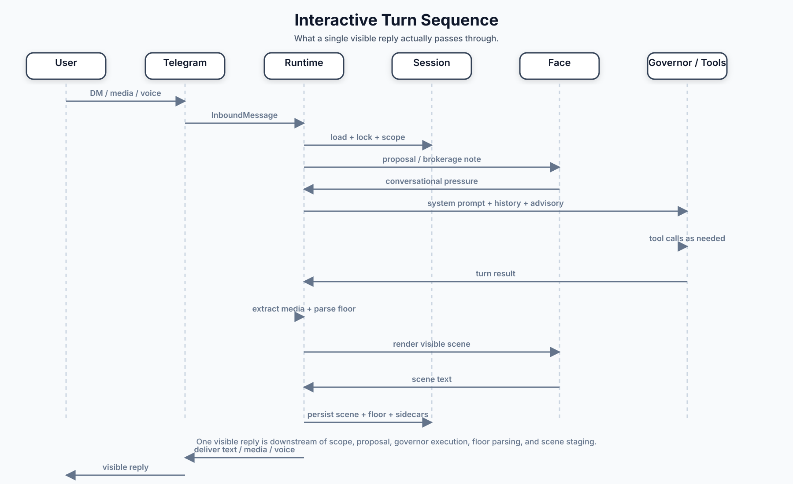

# Turn Lifecycle

## Interactive DM

Current interactive turn order:

1. Runtime resolves principal/scope and loads session under lock.
2. `turn.Machine` runs proposal/governor/face stages according to policy.
3. `turn` persists transcript + sidecars.
4. `turn` performs outbound delivery semantics.
5. Runtime handles process-level follow-up work.

Code anchors:

- [`runtime/turn.go`](../../runtime/turn.go)
- [`runtime/turn_coordinator_common.go`](../../runtime/turn_coordinator_common.go)
- [`runtime/turn_coordinator_interactive.go`](../../runtime/turn_coordinator_interactive.go)
- [`turn/engine.go`](../../turn/engine.go)
- [`turn/render_stage.go`](../../turn/render_stage.go)
- [`turn/persist_stage.go`](../../turn/persist_stage.go)
- [`turn/delivery_stage.go`](../../turn/delivery_stage.go)

## Maintenance Species

Heartbeat, cron, and startup recovery also route through `turn.Machine`, with
species-specific policy and delivery behavior in runtime adapters.

Code anchors:

- [`runtime/maintenance_turn.go`](../../runtime/maintenance_turn.go)
- [`turn/policy.go`](../../turn/policy.go)

## Durable Child Species

Durable Telegram group child turns share the same engine with runtime-owned
child adapter context and policy hooks.

Code anchors:

- [`runtime/durable_group.go`](../../runtime/durable_group.go)
- [`runtime/turn_coordinator_common.go`](../../runtime/turn_coordinator_common.go)
- [`runtime/turn_coordinator_durable.go`](../../runtime/turn_coordinator_durable.go)

Related requirements:

- [`requirements/core.md`](../../requirements/core.md)
- [`requirements/heartbeat.md`](../../requirements/heartbeat.md)
- [`requirements/cron.md`](../../requirements/cron.md)
- [`requirements/durable-agents.md`](../../requirements/durable-agents.md)
